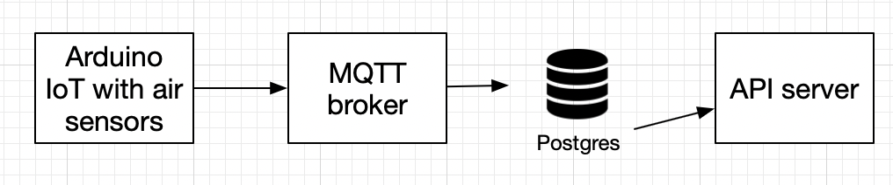

# Airy

This repository contains code for Airy hobby project. The goal of the project is to collect air quality measurements in the appartment and display those on a dashboard in a web app.

For simplicity the code is written only to meet the specific requirements of this project. However with minimal changes it should be possible to extend the data model and API to store and display other kinds of measurements. 



## Backend

Backend is written in Golang and consists of 2 applications:
  - `server` provides an HTTP API to query measurements, also renders graphs to view in the browser
  - `processor` connects to MQTT broker, subscribes to measurements sent by IoT and persists those to a postgres database.

  

## IoT
- [Arduino Nano 33 IoT with BME680 air sensor](./iot/). It collects air quality, temperature, humidity and other enviromental data and sends it to an MQTT broker.

## Local development

### Setup .env file

Copy sample env file and provide correct values.
```
cp .env.sample .env 
```

### Setup mosquitto password file

To use default credentials do:
```bash
cp __binds/mosquitto/config/password_file.sample __binds/mosquitto/config/password_file
```
That would allow connecting using default credentials, which can be found in `.env.sample` file.

See [mosquitto_passwd docs](https://www.mankier.com/1/mosquitto_passwd) for more information.

### Start the app and dependencies

Run dependencies in Docker and apps on the host:

```bash
make docker-dev
make server
make processor
```

Or run everything in Docker

```bash
make docker-prod
```

At this point we should be able to see an empty graph at http://localhost:8081/api/graphs?resolution=60

### Adding measurements
We can publush a test measurement with `make test-publisher`. Wait a minute and publush another measurement.  If all worked well we should be able to see the measurement on the graph with a minute resolution. Ensure correct `BROKER_ADDRESS` in .env file for command to work.

## VM setup

The app was designed to be deployed on a Digital Ocean VM which has Docker, Certbot and Nginx installed. The instructions below provide the steps I used in my case, but there are probably different ways to do it. 

### SSL
Certificates are configured using certbot:

```
sudo certbot --nginx -d amiselaytes.com -d airy.amiselaytes.com
```
This command generates autrenewabale certificates stored in `/etc/letsencrypt/live/amiselaytes.com` folder.

See also [those docs](https://www.digitalocean.com/community/tutorials/how-to-secure-nginx-with-let-s-encrypt-on-ubuntu-20-04)

### Nginx

SSL connection is terminated in NGINX, then traffic from NGINX to MQTT in docker container is not encrypted.

The following nginx config is used:

```
stream {
  upstream mosquitto {
    server 127.0.0.1:1883;
  }

  server {
      listen 8883 ssl;
      ssl_certificate     /etc/letsencrypt/live/amiselaytes.com/cert.pem;
      ssl_certificate_key  /etc/letsencrypt/live/amiselaytes.com/privkey.pem;
      proxy_pass mosquitto;
  }
}
```

## API specification

### Create a measurement

Message format for the measurements is white space separate string in the following order
`SensorID IAQ CO2 VOC Pressure Temperature Humidity`. 

For example `bedroom 51.86 607.44 0.52 100853 27.25 60.22` would create a measurement for 
sensorId=bedroom, IAQ=51.86, CO2=607.44, VOC=0.52, Pressure=100853, Temperature=27.25, and Humidity=60.22.

Messages should be sent to the broker address and `/measurement` route.

### Graphs

GET /api/graphs

Query parameters
- `view` optional, default to `day`, can be one of `day`, `week`
- `date` optional, default to today, in the yyyy-mm-dd format, such as 2024-01-01
- `resolution` must be in ms, for example 86400 for a day, 3600 for an hour

### Measurements

#### Query measurements

GET /api/measurements?resolution=86400&to=1702156335&from=1701810734

- `from` must be a unix timestamp in ms
- `to` must be a unix timestamp in ms
- `resolution` must be in ms, for example 86400 for a day, 3600 for an hour

```json
[
  {
    "timestamp": 1701734400,
    "sensorId": "bedroom",
    "iaq": 108.49368098159503,
    "co2": 949.001042944785,
    "voc": 1.4850920245398769,
    "pressure": 101128.12865030681,
    "temperature": 18.051226993865033,
    "humidity": 44.831656441717776
  },
  {
    "timestamp": 1701734400,
    "sensorId": "livingroom",
    "iaq": 98.50804878048783,
    "co2": 940.1318902439023,
    "voc": 1.377317073170732,
    "pressure": 101159.84170731703,
    "temperature": 20.659268292682928,
    "humidity": 42.94823170731707
  }
]
```

### Events

#### Create event
POST /api/events

```json
{
  "startTimestamp": 1698090929,
  "eventType": "window:open",
  "locationId": "bedroom"
}
```

- `startTimestamp` required, must be unix timestamps in ms.
- `eventType` required, must be a string, can be anything
- `eventType` required, must be a string, one of `bedroom`, `livingroom`

```bash
curl -X POST -H "Content-Type: application/json" -d '{"startTimestamp": 1698090929, "eventType": "window:open", "locationId": "bedroom"}' http://localhost:8081/api/events
```

#### Query events

GET /api/events?from=1698090929&to=1698090930

- `from` must be unix timestamps in ms.
- `to` must be unix timestamps in ms.
- `to` must be greater than `from`

```json
[{
  "id": "uuid",
  "startTimestamp": 1698090929,
  "endTimestamp": 1698090929,
  "eventType": "window:open",
  "locationId": "bedroom"
}]
```

#### Add end timestamp to event

PATCH  /api/events/:eventId

```json
{"endTimestamp": 1698090929}
```

```bash
curl -X PATCH -H "Content-Type: application/json" -d '{"endTimestamp": 1698090929}' http://localhost:8081/api/events
```