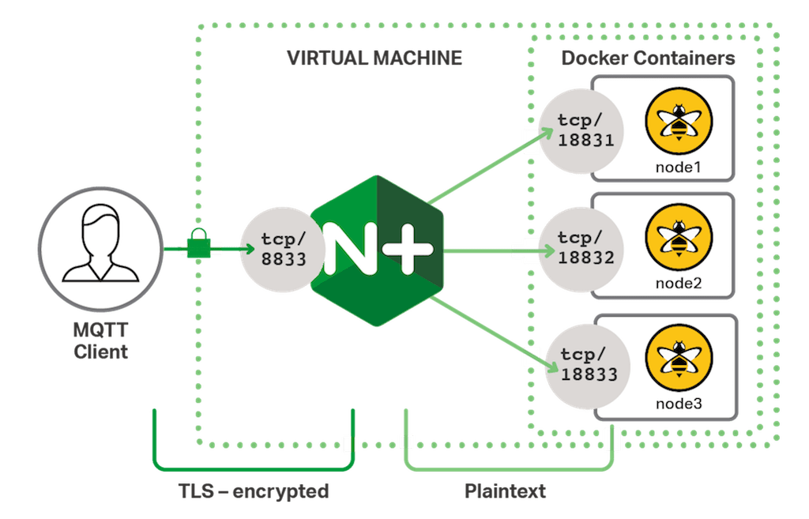

## Local development

### Setup .env file

```
cp .env.sample .env 
```
Now modify env to provide correct values.

### Start docker with services and the server

```
make docker-dev
make server
```

## VM setup

### Access
Applications running in docker can be accessed from exteranl host as well.
This is because `sudo ufw status` gives us:

```
To                         Action      From
--                         ------      ----
22/tcp                     LIMIT       Anywhere
2375/tcp                   ALLOW       Anywhere
2376/tcp                   ALLOW       Anywhere
22/tcp (v6)                LIMIT       Anywhere (v6)
2375/tcp (v6)              ALLOW       Anywhere (v6)
2376/tcp (v6)              ALLOW       Anywhere (v6)
```

Where 2375/tcp and 2376/tcp rules are giving docker permission to route requests to any open port on the host machine. Docker usese it to expose container ports. See also [uwf](https://wiki.ubuntu.com/UncomplicatedFirewall) docs.

### SSL

#### Reminder of how SSL works

- Browser connects to a web server (website) secured with SSL (https). Browser requests that the server identify itself.
- Server sends a copy of its SSL Certificate, including the server’s public key.
- Browser checks the certificate root against a list of trusted CAs and that the certificate is unexpired, unrevoked, and that its common name is valid for the website that it is connecting to. If the browser trusts the certificate, it creates, encrypts, and sends back a symmetric session key using the server’s public key.
- Server decrypts the symmetric session key using its private key and sends back an acknowledgement encrypted with the session key to start the encrypted session.
- Server and Browser now encrypt all transmitted data with the session key.

#### SSL and MQTT setup

Certificates are configured using certbot

```
sudo certbot --nginx -d amiselaytes.com -d tatadata.amiselaytes.com
```
This command generates autrenewabale certificates stored in `/etc/letsencrypt/live/amiselaytes.com` folder.

See also [those docs](https://www.digitalocean.com/community/tutorials/how-to-secure-nginx-with-let-s-encrypt-on-ubuntu-20-04)

SSL connection is terminated in NGINX, then traffic from NGINX to MQTT in docker container is not encrypted.



The following nginx config is used:

```
stream {
  upstream mosquitto {
    server 127.0.0.1:1883;
  }

  server {
      listen 8883 ssl;
      ssl_certificate     /etc/letsencrypt/live/amiselaytes.com/cert.pem;
      ssl_certificate_key  /etc/letsencrypt/live/amiselaytes.com/privkey.pem;
      proxy_pass mosquitto;
  }
}
```

Command for testing SSL connection:
```
mosquitto_pub -d -h $MQTT_HOST -p $MQTT_PORT -t "topic/test" -m "test123" -i "some-client-id" -u $MQTT_USER -P $MQTT_PASSWORD --cafile $CA_CHAIN_PEM_PATH
```