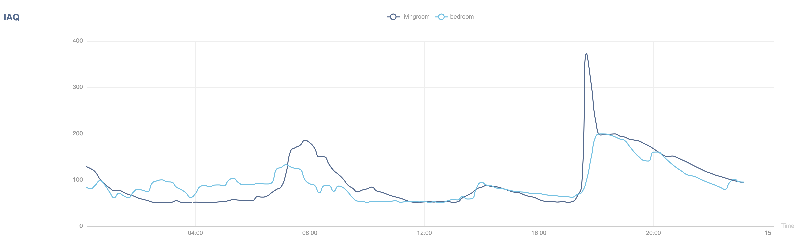
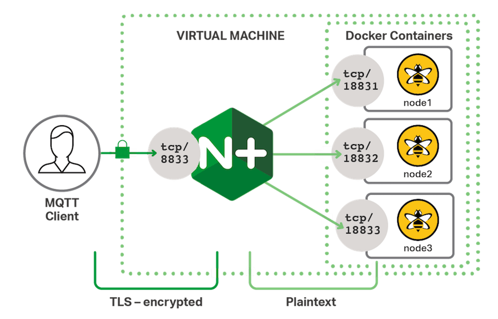

# Airy backend

This repository contains backend code for airy project. Project consists of:
- [Arduino IoT with environmental sensors](https://github.com/oddnoodles/airy-iot). It collects air quality, temperature, humidity and other enviromental data and sends it to an MQTT broker. 
- [Mobile app](https://github.com/oddnoodles/airy-app). It allows to manage air events and view graphs for measurements.
- Backend (this repository) consists of 2 applications:
  - `api` for a mobile client, which provides possibility to manage air events and query enviromental measurements
  - `processor` which connects to MQTT broker, subscribes to measurements sent by IoT and persists those to postgres database.

  Backend also renders graphs which can be viewed in the browser at https://airy.amiselaytes.com/api/graphs

  


## Local development

### Setup .env file

```
cp .env.sample .env 
```
Now modify env to provide correct values.

### Start docker with services and the server

```
make docker-dev
make server
```

## VM setup

### Firewall

Applications running in docker can be accessed from exteranl host as well.
This is because `sudo ufw status` gives us:

```
To                         Action      From
--                         ------      ----
22/tcp                     LIMIT       Anywhere
2375/tcp                   ALLOW       Anywhere
2376/tcp                   ALLOW       Anywhere
22/tcp (v6)                LIMIT       Anywhere (v6)
2375/tcp (v6)              ALLOW       Anywhere (v6)
2376/tcp (v6)              ALLOW       Anywhere (v6)
```

Where 2375/tcp and 2376/tcp rules are giving docker permission to route requests to any open port on the host machine. Docker usese it to expose container ports. See also [uwf](https://wiki.ubuntu.com/UncomplicatedFirewall) docs.

### SSL

<details>
<summary>Reminder of how SSL works</summary>

- Browser connects to a web server (website) secured with SSL (https). Browser requests that the server identify itself.
- Server sends a copy of its SSL Certificate, including the server’s public key.
- Browser checks the certificate root against a list of trusted CAs and that the certificate is unexpired, unrevoked, and that its common name is valid for the website that it is connecting to. If the browser trusts the certificate, it creates, encrypts, and sends back a symmetric session key using the server’s public key.
- Server decrypts the symmetric session key using its private key and sends back an acknowledgement encrypted with the session key to start the encrypted session.
- Server and Browser now encrypt all transmitted data with the session key.
</details>

Certificates are configured using certbot:

```
sudo certbot --nginx -d amiselaytes.com -d airy.amiselaytes.com
```
This command generates autrenewabale certificates stored in `/etc/letsencrypt/live/amiselaytes.com` folder.

See also [those docs](https://www.digitalocean.com/community/tutorials/how-to-secure-nginx-with-let-s-encrypt-on-ubuntu-20-04)

SSL connection is terminated in NGINX, then traffic from NGINX to MQTT in docker container is not encrypted.

<details>
<summary>Diagram</summary>

</details>

The following nginx config is used:

```
stream {
  upstream mosquitto {
    server 127.0.0.1:1883;
  }

  server {
      listen 8883 ssl;
      ssl_certificate     /etc/letsencrypt/live/amiselaytes.com/cert.pem;
      ssl_certificate_key  /etc/letsencrypt/live/amiselaytes.com/privkey.pem;
      proxy_pass mosquitto;
  }
}
```

Command for testing SSL connection:
```
make test-publisher
```

Ensure correct `BROKER_ADDRESS` in .env file for command to work.

## API specification

### Events

#### Create event
POST /api/events

```json
{
  "startTimestamp": 1698090929,
  "eventType": "window:open",
  "locationId": "bedroom"
}
```

- `startTimestamp` required, must be unix timestamps in ms.
- `eventType` required, must be a string, can be anything
- `eventType` required, must be a string, one of `bedroom`, `livingroom`

```bash
curl -X POST -H "Content-Type: application/json" -d '{"startTimestamp": 1698090929, "eventType": "window:open", "locationId": "bedroom"}' http://localhost:8081/api/events
```

#### Query events

GET /api/events?from=1698090929&to=1698090930

- `from` must be unix timestamps in ms.
- `to` must be unix timestamps in ms.
- `to` must be greater than `from`

```json
[{
  "id": "uuid",
  "startTimestamp": 1698090929,
  "endTimestamp": 1698090929,
  "eventType": "window:open",
  "locationId": "bedroom"
}]
```

#### Add end timestamp to event

PATCH  /api/events/:eventId

```json
{"endTimestamp": 1698090929}
```

```bash
curl -X PATCH -H "Content-Type: application/json" -d '{"endTimestamp": 1698090929}' http://localhost:8081/api/events
```

### Measurements

#### Query measurements

GET /api/measurements?resolution=86400&to=1702156335&from=1701810734

- `from` must be a unix timestamp in ms
- `to` must be a unix timestamp in ms
- `resolution` must be in ms, for example 86400 for a day, 3600 for an hour

```json
[
  {
    "timestamp": 1701734400,
    "sensorId": "bedroom",
    "iaq": 108.49368098159503,
    "co2": 949.001042944785,
    "voc": 1.4850920245398769,
    "pressure": 101128.12865030681,
    "temperature": 18.051226993865033,
    "humidity": 44.831656441717776
  },
  {
    "timestamp": 1701734400,
    "sensorId": "livingroom",
    "iaq": 98.50804878048783,
    "co2": 940.1318902439023,
    "voc": 1.377317073170732,
    "pressure": 101159.84170731703,
    "temperature": 20.659268292682928,
    "humidity": 42.94823170731707
  }
]

```
